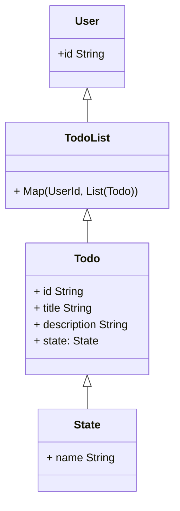

# Exercise

Implementez le domaine TodoList:

- [X] implementer le use case AddTodo
- [X] implementer le use case GetTodo
- [ ] implementer le use case UpdateTodo

avec le pseudo model suivant:

```mermaid
classDiagram
  User <|-- TodoList
  TodoList <|-- Todo
  Todo <|-- State
  class User {
    +id String
  }
  class TodoList {
    + Map(UserId, List(Todo))
  }
  class Todo {
    + id String
    + title String
    + description String
    + state: State
  }
  class State {
    + name String
  }
```
